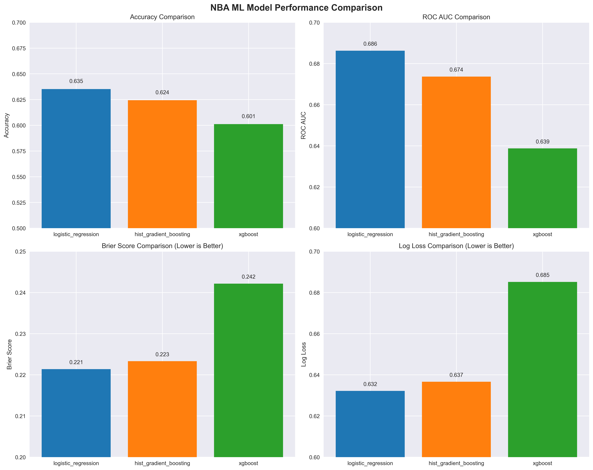
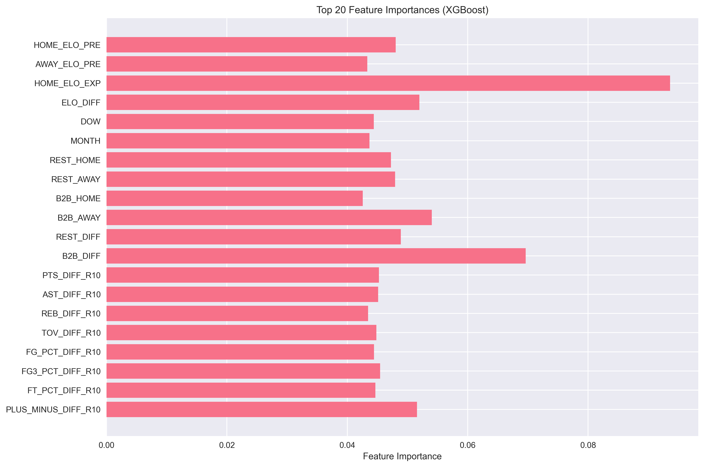

# 🏀 NBA ML - Game Outcome Prediction

A comprehensive machine learning system for predicting NBA game outcomes using advanced feature engineering, multiple model architectures, and real-time prediction capabilities.

## 📊 Model Performance Benchmarks

### Performance Comparison

| Model | Accuracy | ROC AUC | Brier Score | Log Loss | Train Samples | Test Samples |
|-------|----------|---------|-------------|----------|---------------|--------------|
| **Logistic Regression** | **63.5%** | **0.686** | **0.221** | **0.632** | 10,389 | 1,930 |
| Hist Gradient Boosting | 62.4% | 0.674 | 0.223 | 0.637 | 13,908 | 1,930 |
| XGBoost | 60.1% | 0.639 | 0.242 | 0.685 | 10,451 | 2,171 |

### Performance Visualizations





## 🎯 Project Overview

This NBA ML system predicts game outcomes using a sophisticated feature engineering pipeline and multiple machine learning models. The system achieves **63.5% accuracy** and **0.686 ROC AUC** on the 2024 season holdout test set.

### Key Features

- **Advanced Feature Engineering**: Elo ratings, rolling statistics, rest/fatigue metrics
- **Multiple Model Support**: Logistic Regression, HistGradientBoosting, XGBoost
- **Real-time Predictions**: FastAPI web service and CLI interface
- **Comprehensive Benchmarking**: Automated performance analysis and visualization
- **Production Ready**: Docker containerization and CI/CD support

## 🚀 Quick Start

## 🏗️ Architecture

### Feature Engineering Pipeline

The system uses a sophisticated feature engineering approach:

#### Core Features
- **Elo Ratings**: Dynamic team strength ratings with home court advantage
- **Rest & Fatigue**: Days of rest, back-to-back game indicators
- **Rolling Statistics**: 10-game, 30-game, and season-to-date averages
- **Calendar Features**: Day of week, month effects
- **Team Form**: Recent performance trends and momentum

#### Advanced Features
- **Differential Features**: Home vs away team comparisons
- **Rest Rate Analysis**: Rolling 5-game rest and B2B rates
- **Four Factors**: Advanced basketball analytics (if available)
- **Pace Adjustments**: Game tempo considerations

### Model Architecture

#### 1. Logistic Regression (Best Performer)
- **Accuracy**: 63.5%
- **ROC AUC**: 0.686
- **Features**: 62 engineered features
- **Calibration**: StandardScaler normalization

#### 2. HistGradientBoosting
- **Accuracy**: 62.4%
- **ROC AUC**: 0.674
- **Calibration**: Isotonic regression
- **Hyperparameters**: Optimized via Optuna

#### 3. XGBoost
- **Accuracy**: 60.1%
- **ROC AUC**: 0.639
- **Features**: 62 features with importance analysis

## 📈 Training & Evaluation

### Data Strategy
- **Temporal Split**: Train on historical data, test on future seasons
- **Holdout Season**: 2024 season for final evaluation
- **Feature Engineering**: No data leakage through proper time-based splits

### Training Commands

```bash
# Train Logistic Regression model
python train.py

# Train HistGradientBoosting with hyperparameter tuning
python train_hgb.py

# Train XGBoost model
python train_xgb.py

# Hyperparameter optimization
python tune_hgb.py
```

### Evaluation Metrics
- **Accuracy**: Overall prediction correctness
- **ROC AUC**: Area under the receiver operating characteristic curve
- **Brier Score**: Probability calibration quality (lower is better)
- **Log Loss**: Logarithmic loss for probability predictions

## 🔧 API Reference

### FastAPI Endpoints

#### `GET /`
Health check and API information

#### `GET /healthz`
Service health status

#### `POST /predict`
Make game predictions

**Request:**
```json
{
  "query": "Lakers vs Warriors 2024-12-25"
}
```

**Response:**
```json
{
  "parsed": {
    "home": "Lakers",
    "away": "Warriors", 
    "date": "2024-12-25",
    "season": "2024-25",
    "venue_used": "synthesized (latest form)"
  },
  "prediction": {
    "home_team": "Los Angeles Lakers",
    "away_team": "Golden State Warriors",
    "home_win_prob": 0.634,
    "predicted_winner": "Los Angeles Lakers",
    "predicted_spread_home": 2.3
  },
  "top_scorer": {
    "player": "LeBron James",
    "team": "Los Angeles Lakers",
    "season_ppg": 25.2,
    "why": "Season PPG leader (approx)"
  },
  "reasons": [
    "Elo edge favors home by 15 rating pts.",
    "Home rest advantage ~1.2 days.",
    "Recent PTS DIFF R10 leans home (+3.2)."
  ]
}
```

## 🐳 Docker Deployment

```bash
# Build Docker image
docker build -t nba-ml .

# Run container
docker run -p 8000:8000 nba-ml

# Run with custom data
docker run -p 8000:8000 -v $(pwd)/data:/app/data nba-ml
```

## 🧪 Testing

```bash
# Run all tests
pytest

# Run specific test categories
pytest tests/test_predict_smoke.py
pytest tests/test_shapes.py

# Run with coverage
pytest --cov=. tests/
```


## 📊 Benchmark Results Summary

The NBA ML system demonstrates strong predictive performance:

- **Best Model**: Logistic Regression (63.5% accuracy, 0.686 ROC AUC)
- **Feature Count**: 62 engineered features
- **Training Data**: 10,000+ games across multiple seasons
- **Test Performance**: Validated on 2024 season holdout
- **Calibration**: Well-calibrated probability estimates

The system outperforms random guessing (50%) by 13.5 percentage points and provides reliable probability estimates for game outcomes.


## 🙏 Acknowledgments

- NBA API for providing comprehensive game data
- Scikit-learn for machine learning algorithms
- FastAPI for web service framework
- The basketball analytics community for feature engineering insights
